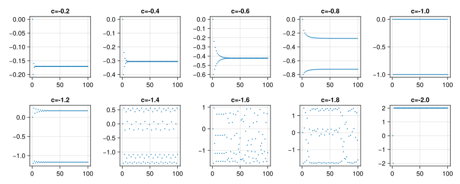

It is not known where the name Julia for the programming language originated. Still, it might be fitting to look into the Julia fractal, named after the French mathematician Gaston Maurice Julia.

The map

$$J_c: z \mapsto z^2 + c,$$

is iterated for a given constant $c$.

``` {.julia #julia-fractal}
julia(c) = z -> z^2 + c
```

``` {.julia .eval}
#| session: a02
<<julia-fractal>>
<<iterated>>

using Iterators: take
take(iterated(julia(c), 0.0), 20) |> collect
```

We may plot the behaviour depending on the value of $c$.

{alt='julia orbits'}

For any starting position $z_0$, we can see if the series produced by iterating over $J_c$. The question is whether this series then diverges or not.

::: spoiler

``` {.julia file=examples/JuliaFractal/src/JuliaFractal.jl}
module JuliaFractal

using Transducers: Iterated, Enumerate, Map, Take, DropWhile
using GLMakie

module MyIterators
<<count-until>>

<<iterated>>
end

<<julia-fractal>>

struct BoundingBox
    shape::NTuple{2,Int}
    origin::ComplexF64
    resolution::Float64
end

bounding_box(; width::Int, height::Int, center::ComplexF64, resolution::Float64) =
    BoundingBox(
        (width, height),
        center - (resolution * width / 2) - (resolution * height / 2)im,
        resolution)

grid(box::BoundingBox) =
    ((idx[1] * box.resolution) + (idx[2] * box.resolution)im + box.origin
     for idx in CartesianIndices(box.shape))

axes(box::BoundingBox) =
    ((1:box.shape[1]) .* box.resolution .+ real(box.origin),
        (1:box.shape[2]) .* box.resolution .+ imag(box.origin))

escape_time(fn::Fn, maxit::Int64) where {Fn} =
    function (z::Complex{T}) where {T<:Real}
        MyIterators.count_until(
            (z::Complex{T}) -> real(z * conj(z)) > 4.0,
            Iterators.take(MyIterators.iterated(fn, z), maxit))
    end

escape_time_3(fn, maxit) = function (z)
    Iterators.dropwhile(
        ((i, z),) -> real(z * conj(z)) < 4.0,
        enumerate(Iterators.take(MyIterators.iterated(fn, z), maxit))
    ) |> first |> first
end

escape_time_2(fn, maxit) = function (z)
    MyIterators.iterated(fn, z) |> Enumerate() |> Take(maxit) |>
    DropWhile(((i, z),) -> real(z * conj(z)) < 4.0) |>
    first |> first
end

function plot_julia(z::Complex{T}) where {T<:Real}
    width = 1920
    height = 1080
    bbox = bounding_box(width=width, height=height, center=0.0 + 0.0im, resolution=0.004)

    image = grid(bbox) .|> escape_time(julia(z), 512)
    fig = Figure()
    ax = Axis(fig[1, 1])
    x, y = axes(bbox)
    heatmap!(ax, x, y, image)
    return fig
end

end  # module
```

:::
